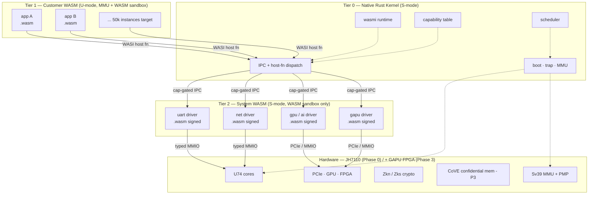
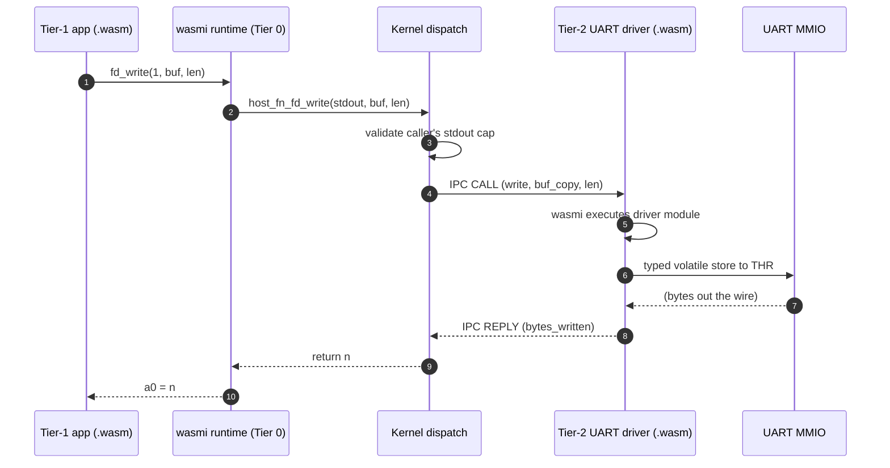

# Wari — Architecture (living document)

> **Scope**: the current architecture. Not the vision (see
> `book/part-1-architecture/` for that), not the roadmap (see
> `../CLAUDE.md` §Roadmap). Only what's true *right now*.

**Status**: Phase 0 scaffold. Kernel surface declared; implementations
pending cherry-pick from `../goose-os/`.

---

## Component overview

## Control flow — Tier-1 syscall

A Tier-1 app calls `fd_write(stdout, "Hello")`; this is the full path
through the system.

Two WASM sandbox crossings (Tier 1 → Tier 2), two kernel dispatches,
zero process-level context switches. Every crossing is capability-gated.

## State at Phase 0

| Subsystem        | Status | Source                                                    |
|------------------|--------|-----------------------------------------------------------|
| Workspace layout | Done   | This scaffold                                             |
| ABI (syscalls/errors) | Template | Phase 0a cherry-pick from `goose-os/kernel/src/abi.rs` |
| Tier 0 memory    | Scaffold | Cherry-pick from `goose-os/kernel/src/{page_alloc,page_table,kvm}.rs` |
| Tier 0 scheduler | Scaffold | Cherry-pick from `goose-os/kernel/src/{process,sched}.rs` |
| Tier 0 IPC       | Scaffold | Cherry-pick from `goose-os/kernel/src/ipc.rs`             |
| Tier 0 trap      | Scaffold | Cherry-pick from `goose-os/kernel/src/trap.rs` (dispatch-table form) |
| Typed MMIO (R3)  | Scaffold | New in Phase 0a — `mmio/volatile.rs`                      |
| wasmi embedding  | Not started | Phase 0b                                                 |
| WASI host fns    | Not started | Phase 0b                                                 |
| Tier 1 hello     | Scaffold | Phase 0c                                                 |
| Capability system | Not started | Phase 1a                                                 |
| Tier-2 drivers   | Placeholders | Phase 1b–d                                             |

## Open questions — resolve before leaving Phase 0

1. **wasmi pinned version + feature set.** Phase 0b proposal PR.
2. **How do `.wasm` bundles get signed and verified at boot?** Proposal
   PR before Phase 0c.
3. **PID allocation policy for Tier-1 vs Tier-2.** Currently assumed:
   PID 1 = first Tier-1, PID 2+ = Tier-1 pool, PIDs from 16 up are
   Tier-2 drivers. To be confirmed in Phase 0 closeout.

See `book/part-1-architecture/` for the narrative derivation of this
architecture and why it looks like this.
