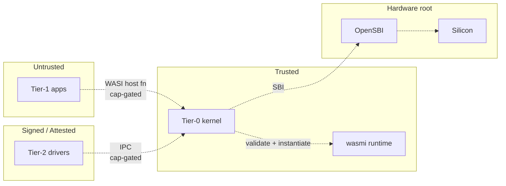

# Wari — Security Model

> Threat model, trust boundaries, defenses, and the assumptions under
> which those defenses hold. Updated every phase milestone.

---

## Three layers, three sandboxes

Every tenant workload runs inside **three** security layers. Any one
of them alone would be a real but breakable defense. Stacked, a
single failure doesn't break isolation.

| Layer | Mechanism | Primary guarantee | Broken by | Status |
|---|---|---|---|---|
| **1. Structural** | WASM validator + type system (`wasmi`) | Tier-1 module cannot construct pointers outside its linear memory | Bug in `wasmi` validator or interpreter | Phase 0 |
| **2. Hardware (Sv39 MMU)** | Separate page tables per Tier-1 instance | Tier-1 cannot read/write other-tenant or kernel memory even with a layer-1 escape | Kernel page-table management bug | Phase 0 |
| **3a. Hardware (PMP)** | RISC-V Physical Memory Protection | Redundant memory region enforcement independent of page tables | Bug in PMP setup | Phase 1 |
| **3b. Cryptographic** | AES-256-GCM at-rest, BLAKE3 in-flight (Zkn/Zks hw) | Even if attacker exfiltrates raw memory or disk blocks, contents are ciphertext | Key-management compromise | Phase 2 |
| **3c. Confidential compute** | RISC-V CoVE | Ciphertext RAM per tenant — kernel core-dump leaks nothing | Hardware side-channel | Phase 3 |

**Rule**: a feature that crosses a trust boundary (adds a host fn,
adds a capability, widens driver MMIO surface) does not merge until
its effect on this table is updated.

---

## Trust boundaries

- **Tier-1 → Tier-0**: widest surface, most critical. Every WASI host
  function is an attack vector. Audited host-fn-by-host-fn.
- **Tier-2 → Tier-0**: narrower; Tier-2 modules are signed + attested,
  but still sandboxed (they run inside wasmi). IPC is the only data
  path.
- **Tier-0 → Hardware**: trusted; the kernel is the silicon's peer.
- **Between Tier-1 instances**: zero direct path. Shared state only
  through Tier-0 (via IPC) or Tier-2 (via drivers).

---

## Threat model (Phase 0–1)

| Threat | Likelihood | Impact | Mitigation |
|---|---|---|---|
| Malicious customer WASM | High | Low (sandboxed) | Layer 1 + 2 |
| `wasmi` validator bug | Low | High | Layer 2 catches escapes + fuzz Tier-1 bytecode |
| Resource exhaustion (fork-bomb analog) | Medium | Medium | Fuel metering (Phase 2) + hard per-module memory cap |
| Tier-2 driver compromise | Low | High | Signed loading + Layer 2 MMU still enforces kernel isolation from driver |
| Kernel memory-safety bug | Low | Critical | Rust type system + INV-N audit + formal verif Phase 3+ |
| Hardware backdoor (x86-style ME) | None on RISC-V | N/A | ISA choice — open, auditable silicon |
| Data exfiltration from disk | Medium | High | Layer 3b (hw crypto, Phase 2) |
| Data exfil from memory dump | Medium | High | Layer 3c (CoVE, Phase 3) |
| Supply-chain attack | Medium | High | Reproducible builds (R8), pinned deps, single-source-of-truth ABI |
| Foreign legal access | Varies | Critical | LATAM jurisdiction; no US-controlled silicon |
| Physical tampering | Low | Critical | Phase 4 — hash-attested ROM kernel, burn-in SoC |

---

## Assumptions we explicitly depend on

1. **The Rust compiler's safety guarantees hold for `safe` code.**
   A Rust codegen bug would defeat us, like any Rust project. We
   mitigate by pinning the compiler version and waiting for CVE
   history to settle before upgrading.

2. **The `wasmi` validator is correct.** Our biggest single-point
   dependency. Mitigations: (a) fuzz it continuously, (b) keep
   Layer 2 active so validator bugs are contained to one tenant's
   MMU domain, (c) Phase 4 formal verification of wasmi's core.

3. **RISC-V silicon implements Sv39 correctly.** We can't verify
   silicon; we bet on open hardware's auditability and the ecosystem
   catching bugs before they matter.

4. **OpenSBI is correct at its narrow interface.** We inherit this
   from the ecosystem. We don't extend SBI. Small surface.

---

## Audit cadence

| When | Scope | Output |
|---|---|---|
| **Per PR** | Security considerations section in PR body | Reviewer sign-off |
| **Phase 0 gate** | Every Tier-1 host fn; fuzz harness runs; invariant coverage | `docs/audits/phase-0.md` |
| **Phase 1 gate** | Capability system formal review; threat model v2 | `docs/audits/phase-1.md` |
| **Phase 2 gate** | Crypto integration; side-channel analysis | `docs/audits/phase-2.md` |
| **Phase 3 gate** | External security-firm audit; formal-methods coverage report | `docs/audits/phase-3.md` |
| **Phase 4 gate** | Pre-tapeout formal verification of kernel + wasmi | `docs/audits/phase-4.md` |

Each audit produces a dated document with: findings, severity,
remediation plan, sign-off.
