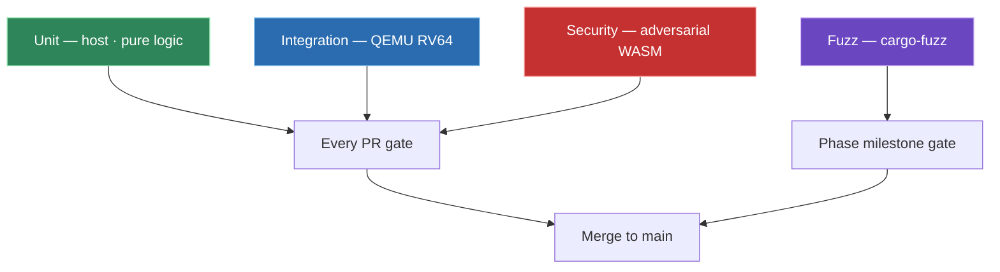

# Wari — Testing Strategy

> Test coverage grows **with** the code. Every phase milestone has
> test gates that block the milestone if they don't pass. Details
> expanded from `../CLAUDE.md` §Testing Strategy.

---

## The four layers

### Unit tests — fast, many, pure

**Where**: inline `#[cfg(test)] mod` in every pure-logic module.

**Subject**:
  - `wari-abi` — syscall numbers, error encoding, opcode tables
  - `kernel/src/mem/page_alloc.rs` — bitmap invariants, conservation
  - `kernel/src/mem/page_table.rs` — Sv39 walk against fake memory
  - `kernel/src/validate.rs` — argument validators
  - `kernel/src/sched/process.rs` — PCB state-machine transitions
  - `kernel/src/ipc.rs` — rendezvous state machine (mostly pure)

**Rule**: if a pure module grows `unsafe` or MMIO, split — pure stays
host-testable; impure moves to a `_glue` file.

**Run**: `cargo test --workspace`. Must pass on every PR.

### Integration tests — slow, meaningful

**Where**: `/wari/tests/integration/<testname>.rs`, one binary per
test, each driving `wari-qemu-runner`.

**Harness**:
  1. Build `wari-kernel` for `riscv64gc-unknown-none-elf`.
  2. Optionally build a test `.wasm` module.
  3. Launch QEMU `virt` with deterministic timing (no network, fixed
     RAM, single hart unless testing SMP).
  4. Capture UART output.
  5. Assert on exact markers: `PASS`, specific literal strings, regex
     match, timing bounds.

**Phase-0 tests** (blocking for Phase 0 exit):
  - `boot_smoke.rs` — kernel boots to runtime, banner prints
  - `hello_wasm.rs` — Tier-1 prints "Hello from Wari" + exits 0
  - `exit_reaping.rs` — proc_exit path, scheduler reaps
  - `preempt.rs` — timer-driven preemption observable

### Security tests — adversarial, continuous

**Where**: `/wari/tests/security/<testname>.rs`, each paired with a
WASM module or kernel config **designed to fail safely**.

**Rule**: a new trust-boundary-crossing feature cannot merge until
its adversarial test exists and the malicious input fails safely.
"Tests in a follow-up" is not acceptable for security tests.

**Phase-0 baseline** (blocking for Phase 0 exit):
  - `malformed_wasm.rs` — invalid bytecode → rejected at load
  - `oom_bomb.rs` — module attempts to grow memory past limit
  - `host_fn_escape.rs` — invalid args to WASI fns → typed error
  - `mmio_bypass.rs` — Tier-1 attempts direct MMIO address → trap
  - `page_fault_kill.rs` — Tier-1 accesses kernel VA → killed
  - `kernel_panic_absence.rs` — all of the above leave kernel alive

**Phase-1 additions**:
  - `cap_forgery.rs` — Tier-1 uses an unowned capability
  - `tier_crossing.rs` — Tier-1 calls a Tier-2-only host fn
  - `fuel_exhaustion.rs` — infinite loop hits fuel limit

### Fuzz — wide, periodic

**Where**: `/wari/tests/fuzz/fuzz_targets/`, using `cargo-fuzz` (libFuzzer).

**Targets (phase-ordered)**:
  - Phase 0: `fuzz_wasm_validator` — fuzz wasmi's validator against
    random byte sequences. Check: no panic, every rejection is clean.
  - Phase 0: `fuzz_abi_decode` — random syscall numbers + register
    patterns. Check: kernel never panics.
  - Phase 1: `fuzz_cap_ops` — random capability operations against
    synthetic cap tables.
  - Phase 1: `fuzz_page_walk` — random VAs against random Sv39 trees.

**Not per-PR** (too slow). Runs:
  - Every phase milestone (blocking)
  - Weekly scheduled run
  - Before external release

---

## Per-phase gates

**Each milestone gate is a closed audit document** in `docs/audits/`:

| Milestone | Gate checks | Audit file |
|---|---|---|
| **m0 — Phase 0** | All Phase-0 integration + security tests pass; fuzz clean 1 h; no `ptr::read_volatile` outside `mmio/`; every unsafe block cites INV-N | `docs/audits/phase-0.md` |
| **m1 — Phase 1** | Capability formal review done; adversarial coverage for every host fn; fuzz clean 24 h; threat model v2 signed | `docs/audits/phase-1.md` |
| **m2 — Phase 2** | Crypto integration audited; side-channel review; WASI-NN boundary tests pass; Docker→WASM correctness suite | `docs/audits/phase-2.md` |
| **m3 — Phase 3** | External security-firm audit; CoVE attestation chain verified; formal-methods coverage report; GAPU driver isolation tests | `docs/audits/phase-3.md` |

---

## What "coverage" means here

**Not** a line-coverage percentage. Line coverage rewards testing
easy code.

Wari's standard:
1. Every INV-N has at least one test that would fail if the invariant
   were violated.
2. Every syscall has at least one negative test that verifies
   malformed input returns a typed error, not a panic.
3. Every trust boundary has at least one adversarial test that
   verifies the boundary holds under attack.
4. Every public API has a doctest showing correct usage + at least
   one rejection case.

Line coverage is a side effect, not a target.
